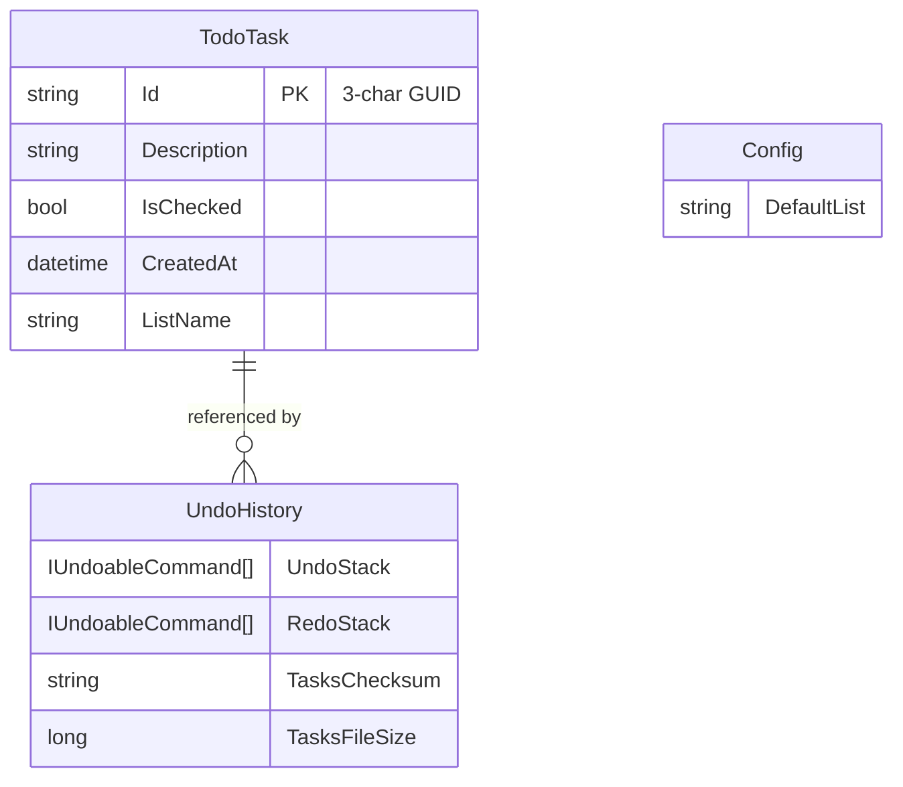
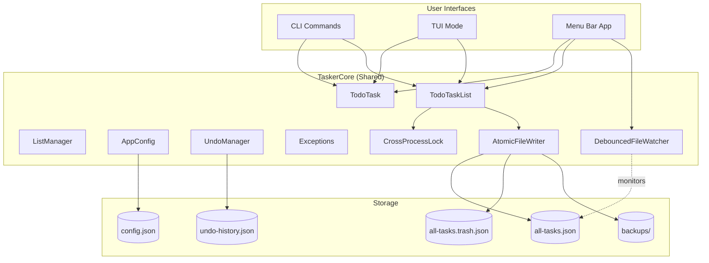

# macOS Menu Bar Desktop App for cli-tasker

## Enhancement Summary

**Deepened on:** 2026-02-01
**Research agents used:** architecture-strategist, performance-oracle, security-sentinel, code-simplicity-reviewer, pattern-recognition-specialist, data-integrity-guardian, best-practices-researcher (x2), Context7

### Key Improvements from Research

1. **Simplified Architecture** - Consider deferring TaskerCore extraction; copy data files instead (JSON is the contract)
2. **Robust Cross-Process Locking** - Use Named Mutex instead of file-based locks; add PID-based stale lock detection
3. **Atomic File Writes** - Write-to-temp-then-rename pattern prevents corruption
4. **Hybrid File Watching** - Combine FileSystemWatcher with polling fallback
5. **AOT-Compatible ViewLocator** - Replace reflection with explicit type registration
6. **Data Integrity** - Add automatic backups, post-write verification, SHA-256 checksums

### Critical Issues Identified

| Issue | Severity | Resolution |
|-------|----------|------------|
| `Output.Error()` in data layer | HIGH | Use Result types or exceptions instead |
| File-based locking insufficient | HIGH | Use Named Mutex for cross-process sync |
| Non-atomic writes | CRITICAL | Temp file + rename pattern |
| FileSystemWatcher unreliable | MEDIUM | Add polling fallback |
| 3-char task IDs collide | LOW | Increase to 6-8 characters |

---

## Overview

Build a native macOS menu bar application using Avalonia UI (.NET) that provides a graphical interface to cli-tasker while sharing the same storage files. The app will live in the menu bar (no Dock icon), offer full CRUD operations, and display a sync indicator when files change externally (e.g., when the CLI modifies tasks).

## Problem Statement / Motivation

Currently, cli-tasker is limited to terminal usage via CLI commands or the TUI mode. Users who prefer graphical interfaces or want quick access without opening a terminal have no option. A menu bar app provides:

1. **Quick access** - One click from anywhere on macOS
2. **Visual task management** - See all tasks at a glance
3. **Sync with CLI** - Both interfaces operate on the same data
4. **Always available** - Lives in menu bar, instant access

## Proposed Solution

Create a new Avalonia UI project (`TaskerTray`) that:

1. **Shares the core data layer** with the CLI via a new shared library (`TaskerCore`)
2. **Uses FileSystemWatcher** to detect external changes to task files
3. **Displays in macOS menu bar** using Avalonia's `TrayIcon` and `NativeMenu`
4. **Compiles with Native AOT** for fast startup (<200ms target)

### Research Insights: Architecture Options

The simplicity reviewer identified that extracting TaskerCore may be over-engineering for this use case:

| Approach | Pros | Cons | Recommendation |
|----------|------|------|----------------|
| **TaskerCore Library** | Code reuse, single source of truth | Build complexity, version coupling | Use if planning Windows/Linux support |
| **Copy Data Files** | Simple, independent releases | Code duplication (~800 LOC) | Use for macOS-only MVP |

**Decision:** Proceed with TaskerCore extraction to enable future cross-platform support, but keep it minimal.

### Solution Architecture

```
cli-tasker.sln
├── src/
│   ├── TaskerCore/                 # NEW: Shared class library
│   │   ├── TaskerCore.csproj
│   │   ├── Models/
│   │   │   └── TodoTask.cs         # Moved from cli-tasker
│   │   ├── Data/
│   │   │   ├── TodoTaskList.cs     # Moved, refactored
│   │   │   ├── ListManager.cs      # Moved
│   │   │   └── TaskStats.cs        # Moved
│   │   ├── Config/
│   │   │   └── AppConfig.cs        # Moved
│   │   ├── Exceptions/
│   │   │   └── TaskerException.cs  # Moved
│   │   ├── Synchronization/        # NEW: Cross-process sync
│   │   │   ├── CrossProcessLock.cs
│   │   │   ├── AtomicFileWriter.cs
│   │   │   └── DebouncedFileWatcher.cs
│   │   └── Undo/                   # Moved (entire folder)
│   │
│   ├── cli-tasker/                 # MODIFIED: Console app
│   │   ├── cli-tasker.csproj       # Add reference to TaskerCore
│   │   ├── Program.cs
│   │   ├── AppCommands/            # CLI-specific
│   │   ├── Tui/                    # TUI-specific
│   │   └── Output.cs               # CLI-specific (Spectre.Console)
│   │
│   └── TaskerTray/                 # NEW: Avalonia menu bar app
│       ├── TaskerTray.csproj
│       ├── Program.cs
│       ├── App.axaml
│       ├── App.axaml.cs
│       ├── ViewModels/
│       │   ├── AppViewModel.cs
│       │   ├── TaskListViewModel.cs
│       │   └── TodoTaskViewModel.cs  # Renamed from TaskItemViewModel
│       ├── Views/
│       │   └── TaskPopoverView.axaml
│       ├── Services/
│       │   └── FileWatcherService.cs # Simplified (merged with SyncIndicator)
│       └── Assets/
│           ├── icon.ico
│           └── icon-syncing.ico
│
├── tests/                          # NEW: Test projects
│   ├── TaskerCore.Tests/
│   └── TaskerTray.Tests/
```

## Technical Approach

### Architecture

#### Phase 1: Extract Shared Core Library

The data layer must be extracted from cli-tasker into a shared library. Key changes:

1. **Remove Spectre.Console dependency** from data layer

### Research Insights: Decoupling Output

The architecture review identified that `TodoTaskList.cs` has 14 direct calls to `Output.Error()`. Use the **Result Pattern** instead of `ITaskerOutput` interface:

```csharp
// TaskerCore/Results/TaskResult.cs - RECOMMENDED APPROACH
public abstract record TaskResult
{
    public record Success(string Message) : TaskResult;
    public record NotFound(string TaskId) : TaskResult;
    public record NoChange(string Message) : TaskResult;
    public record Error(string Message) : TaskResult;
}

// TodoTaskList method returns result instead of void:
public TaskResult CheckTask(string taskId, bool recordUndo = true)
{
    var todoTask = GetTodoTaskById(taskId);
    if (todoTask == null)
        return new TaskResult.NotFound(taskId);
    // ... perform operation
    return new TaskResult.Success($"Checked task: {taskId}");
}
```

**Why Results > Interface:**
- Pure functions without side effects
- Easier to test
- Caller decides how to present (CLI vs GUI vs silent)
- No runtime interface resolution

2. **Abstract file paths** into configuration
   ```csharp
   // TaskerCore/StoragePaths.cs
   public static class StoragePaths
   {
       public static string Directory => Path.Combine(
           Environment.GetFolderPath(Environment.SpecialFolder.ApplicationData),
           "cli-tasker");
       public static string AllTasksPath => Path.Combine(Directory, "all-tasks.json");
       public static string AllTrashPath => Path.Combine(Directory, "all-tasks.trash.json");
       public static string ConfigPath => Path.Combine(Directory, "config.json");
       public static string UndoHistoryPath => Path.Combine(Directory, "undo-history.json");
       public static string BackupDirectory => Path.Combine(Directory, "backups");
   }
   ```

3. **Add file change events** for real-time sync
   ```csharp
   public class TodoTaskList
   {
       public event EventHandler<TasksChangedEventArgs>? TasksChanged;
       // ... existing code
   }
   ```

#### Phase 2: Implement Menu Bar App Core

**App.axaml** - Tray icon with native menu:
```xml
<Application xmlns="https://github.com/avaloniaui"
             xmlns:x="http://schemas.microsoft.com/winfx/2006/xaml"
             x:Class="TaskerTray.App"
             Name="Tasker">

    <TrayIcon.Icons>
        <TrayIcons>
            <TrayIcon Icon="/Assets/icon.ico" ToolTipText="Tasker">
                <TrayIcon.Menu>
                    <NativeMenu>
                        <NativeMenuItem Header="Quick Add..."
                                        Command="{Binding QuickAddCommand}"
                                        Gesture="Meta+N" />
                        <NativeMenuItemSeparator />
                        <!-- Dynamic task list rendered here -->
                        <NativeMenuItem Header="Tasks" x:Name="TasksMenuItem">
                            <NativeMenu x:Name="TasksMenu" />
                        </NativeMenuItem>
                        <NativeMenuItemSeparator />
                        <NativeMenuItem Header="Refresh" Command="{Binding RefreshCommand}" />
                        <NativeMenuItem Header="Open Window" Command="{Binding ShowWindowCommand}" />
                        <NativeMenuItemSeparator />
                        <NativeMenuItem Header="Quit" Command="{Binding QuitCommand}" />
                    </NativeMenu>
                </TrayIcon.Menu>
            </TrayIcon>
        </TrayIcons>
    </TrayIcon.Icons>

    <Application.Styles>
        <FluentTheme />
    </Application.Styles>
</Application>
```

**App.axaml.cs** - Tray-only lifecycle:
```csharp
public override void OnFrameworkInitializationCompleted()
{
    if (ApplicationLifetime is IClassicDesktopStyleApplicationLifetime desktop)
    {
        // Critical: Prevent shutdown when no windows are open
        desktop.ShutdownMode = ShutdownMode.OnExplicitShutdown;
        DataContext = new AppViewModel(desktop);
    }
    base.OnFrameworkInitializationCompleted();
}
```

#### Phase 3: File Watching and Sync Indicator

### Research Insights: Reliable File Watching

FileSystemWatcher is unreliable on macOS. Use a **hybrid approach** with polling fallback:

```csharp
// TaskerCore/Synchronization/DebouncedFileWatcher.cs - IMPROVED VERSION
public sealed class DebouncedFileWatcher : IDisposable
{
    private readonly FileSystemWatcher _watcher;
    private readonly Timer _pollingTimer;
    private readonly TimeSpan _debounceTime;
    private readonly Action<string> _onChanged;

    private CancellationTokenSource? _debounceCts;
    private readonly object _lock = new();
    private DateTime _lastKnownModified = DateTime.MinValue;
    private string _lastKnownHash = "";
    private bool _disposed;

    public DebouncedFileWatcher(
        string filePath,
        Action<string> onChanged,
        TimeSpan? debounceTime = null)
    {
        _debounceTime = debounceTime ?? TimeSpan.FromMilliseconds(100);
        _onChanged = onChanged;

        var directory = Path.GetDirectoryName(filePath)!;
        var fileName = Path.GetFileName(filePath);

        // Primary: FileSystemWatcher for immediate notification
        _watcher = new FileSystemWatcher(directory, fileName)
        {
            NotifyFilter = NotifyFilters.LastWrite | NotifyFilters.Size,
            EnableRaisingEvents = true
        };
        _watcher.Changed += OnFileEvent;
        _watcher.Created += OnFileEvent;
        _watcher.Error += OnWatcherError;

        // Backup: Polling every 2 seconds to catch missed events
        _pollingTimer = new Timer(_ => CheckForChanges(filePath), null,
            TimeSpan.FromSeconds(2), TimeSpan.FromSeconds(2));

        // Initialize baseline
        UpdateBaseline(filePath);
    }

    private void OnFileEvent(object sender, FileSystemEventArgs e)
    {
        // Debounce rapid events
        lock (_lock)
        {
            if (_disposed) return;
            _debounceCts?.Cancel();
            _debounceCts?.Dispose();
            _debounceCts = new CancellationTokenSource();

            var token = _debounceCts.Token;
            Task.Delay(_debounceTime, token).ContinueWith(t =>
            {
                if (!t.IsCanceled && !_disposed)
                    CheckForChanges(e.FullPath);
            }, TaskScheduler.Default);
        }
    }

    private void CheckForChanges(string path)
    {
        try
        {
            if (!File.Exists(path)) return;

            var info = new FileInfo(path);
            if (info.LastWriteTimeUtc <= _lastKnownModified) return;

            // Verify content actually changed (not just timestamp)
            var currentHash = ComputeFileHash(path);
            if (currentHash == _lastKnownHash) return;

            _lastKnownModified = info.LastWriteTimeUtc;
            _lastKnownHash = currentHash;
            _onChanged(path);
        }
        catch (IOException) { /* File may be locked - try next poll */ }
    }

    private void OnWatcherError(object sender, ErrorEventArgs e)
    {
        // Restart watcher on error
        try
        {
            _watcher.EnableRaisingEvents = false;
            _watcher.EnableRaisingEvents = true;
        }
        catch { }
    }

    private void UpdateBaseline(string path)
    {
        if (File.Exists(path))
        {
            _lastKnownModified = new FileInfo(path).LastWriteTimeUtc;
            _lastKnownHash = ComputeFileHash(path);
        }
    }

    private static string ComputeFileHash(string path)
    {
        using var stream = File.OpenRead(path);
        var hash = SHA256.HashData(stream);
        return Convert.ToHexString(hash);
    }

    public void Dispose()
    {
        lock (_lock)
        {
            if (_disposed) return;
            _disposed = true;
            _debounceCts?.Cancel();
            _debounceCts?.Dispose();
            _pollingTimer.Dispose();
            _watcher.Dispose();
        }
    }
}
```

**Sync Indicator Behavior**:
- Normal state: Standard icon
- External change detected: Orange dot badge on icon
- User opens menu after external change: Indicator clears, data is fresh
- External change while menu open: Show subtle "Refresh" indicator, don't auto-refresh (preserves user context)

#### Phase 4: Cross-Process Locking

### Research Insights: Named Mutex over File Locks

The security and data integrity reviews identified that file-based locking is insufficient. Use **Named Mutex** for robust cross-process synchronization:

```csharp
// TaskerCore/Synchronization/CrossProcessLock.cs - IMPROVED VERSION
public sealed class CrossProcessLock : IDisposable
{
    private readonly Mutex _mutex;
    private readonly string _name;
    private bool _hasHandle;

    public CrossProcessLock(string resourceName)
    {
        // Sanitize name for cross-platform compatibility
        _name = $"cli-tasker-{SanitizeName(resourceName)}";
        _mutex = new Mutex(initiallyOwned: false, name: _name, out _);
    }

    public bool TryAcquire(TimeSpan timeout)
    {
        if (_hasHandle) return true;

        try
        {
            _hasHandle = _mutex.WaitOne(timeout);
            return _hasHandle;
        }
        catch (AbandonedMutexException)
        {
            // Previous holder crashed - we now own it
            _hasHandle = true;
            return true;
        }
    }

    public void Acquire(TimeSpan timeout)
    {
        if (!TryAcquire(timeout))
        {
            throw new TimeoutException(
                $"Could not acquire lock '{_name}' within {timeout.TotalMilliseconds}ms.");
        }
    }

    public void Release()
    {
        if (_hasHandle)
        {
            _mutex.ReleaseMutex();
            _hasHandle = false;
        }
    }

    public void Dispose()
    {
        Release();
        _mutex.Dispose();
    }

    private static string SanitizeName(string name) =>
        name.Replace('/', '_').Replace('\\', '_').Replace(':', '_');
}
```

### Research Insights: Atomic File Writes

Prevent corruption with write-to-temp-then-rename pattern:

```csharp
// TaskerCore/Synchronization/AtomicFileWriter.cs
public static class AtomicFileWriter
{
    public static void WriteJson<T>(string filePath, T data, JsonSerializerOptions? options = null)
    {
        var json = JsonSerializer.Serialize(data, options);
        WriteText(filePath, json);
    }

    public static void WriteText(string filePath, string content)
    {
        var directory = Path.GetDirectoryName(filePath);
        if (!string.IsNullOrEmpty(directory))
            Directory.CreateDirectory(directory);

        // Write to temp file in SAME directory (atomic rename requires same filesystem)
        var tempPath = Path.Combine(
            directory ?? ".",
            $".{Path.GetFileName(filePath)}.{Guid.NewGuid():N}.tmp");

        try
        {
            // Write with explicit flush to ensure data hits disk
            using (var stream = new FileStream(tempPath, FileMode.Create,
                FileAccess.Write, FileShare.None, 4096, FileOptions.WriteThrough))
            using (var writer = new StreamWriter(stream))
            {
                writer.Write(content);
                writer.Flush();
                stream.Flush(flushToDisk: true);
            }

            // Atomic rename (on POSIX systems, rename() is atomic)
            File.Move(tempPath, filePath, overwrite: true);
        }
        catch
        {
            try { File.Delete(tempPath); } catch { }
            throw;
        }
    }
}
```

### Implementation Phases

#### Phase 1: Extract TaskerCore Library

**Tasks:**
- [x] Create `TaskerCore.csproj` with net10.0 target, no UI dependencies
- [x] Move `TodoTask.cs` to `TaskerCore/Models/`
- [x] Move `TodoTaskList.cs` to `TaskerCore/Data/`, remove Spectre.Console dependency
- [x] **Refactor TodoTaskList methods to return TaskResult instead of void**
- [x] Move `ListManager.cs` to `TaskerCore/Data/`
- [x] Move `TaskStats.cs` to `TaskerCore/Data/`
- [x] Move `AppConfig.cs` to `TaskerCore/Config/`
- [x] Move `TaskerException.cs` to `TaskerCore/Exceptions/`
- [x] Move entire `Undo/` folder to `TaskerCore/Undo/`
- [x] Create `StoragePaths.cs` for centralized path management
- [x] **Create `CrossProcessLock.cs` using Named Mutex**
- [x] **Create `AtomicFileWriter.cs` for safe file writes**
- [x] **Create `DebouncedFileWatcher.cs` with polling fallback**
- [x] Add `ProjectReference` from cli-tasker to TaskerCore
- [x] **Extract duplicated `Truncate()` helper to `StringHelpers.cs`**
- [x] Verify CLI still builds and passes tests

**Deliverables:**
- TaskerCore library with zero UI dependencies
- CLI working with shared library
- All existing tests passing

#### Phase 2: Create TaskerTray Project

**Tasks:**
- [x] Create `TaskerTray.csproj` with Avalonia dependencies
- [x] Add `ProjectReference` to TaskerCore
- [x] Create `Program.cs` entry point
- [x] Create `App.axaml` with TrayIcon definition
- [x] Create `App.axaml.cs` with `ShutdownMode.OnExplicitShutdown`
- [x] Create `AppViewModel.cs` with basic commands (Quit, Refresh)
- [x] **Create AOT-compatible ViewLocator (explicit type mapping, no reflection)**
- [x] Create `Info.plist` with `LSUIElement` for menu bar-only mode
- [x] Add icon assets (normal and syncing states)
- [x] Verify app launches in menu bar with no Dock icon

### Research Insights: AOT-Compatible ViewLocator

Replace reflection-based ViewLocator:

```csharp
// TaskerTray/ViewLocator.cs - AOT COMPATIBLE
public class ViewLocator : IDataTemplate
{
    private static readonly Dictionary<Type, Func<Control>> ViewFactories = new()
    {
        [typeof(AppViewModel)] = () => new AppView(),
        [typeof(TaskListViewModel)] = () => new TaskListView(),
        [typeof(TodoTaskViewModel)] = () => new TodoTaskView(),
    };

    public Control Build(object? data)
    {
        if (data is null)
            return new TextBlock { Text = "Data is null" };

        if (ViewFactories.TryGetValue(data.GetType(), out var factory))
            return factory();

        return new TextBlock { Text = $"No view for {data.GetType().Name}" };
    }

    public bool Match(object? data) => data is ObservableObject;
}
```

**Deliverables:**
- Menu bar app that launches and shows tray icon
- Can quit via menu
- No Dock icon visible

#### Phase 3: Implement Task Display

**Tasks:**
- [x] Create `TaskListViewModel.cs` that loads tasks from TaskerCore
- [x] Implement dynamic `NativeMenu` population from task list
- [x] Show tasks grouped by list when viewing "All Lists"
- [x] Show task count badge on menu bar icon
- [x] Implement list switching (filter to specific list)
- [x] Handle empty states ("No tasks" message)
- [x] Truncate long task descriptions with "..." and tooltip
- [x] **Limit visible tasks to 15-20 with scroll**

**Deliverables:**
- Tasks visible in menu
- List switching works
- Task counts accurate

#### Phase 4: Implement CRUD Operations

**Tasks:**
- [x] Implement "Quick Add" with text input dialog
- [x] Implement task check/uncheck via menu click
- [x] Implement task delete via context menu or keyboard shortcut
- [ ] Implement task edit/rename via dialog
- [ ] Implement move task to different list
- [x] Wire up undo/redo (Cmd+Z / Cmd+Shift+Z)
- [x] Show status messages for operations ("Added", "Deleted", etc.)
- [x] **Handle TaskResult returns from TodoTaskList operations**

**Deliverables:**
- All CRUD operations functional
- Undo/redo working
- Status feedback for user actions

#### Phase 5: File Watching and Sync

**Tasks:**
- [ ] Implement `DebouncedFileWatcher` with hybrid watching + polling
- [ ] Update icon when external changes detected (menu closed)
- [ ] Show "Refresh" indicator when external changes detected (menu open)
- [ ] Handle undo history invalidation gracefully (show message, clear history)
- [ ] Implement cross-process locking using Named Mutex
- [ ] **Add automatic backup before each save (rolling 5 backups)**
- [ ] **Add post-write verification**
- [ ] Test concurrent CLI/GUI operations

### Research Insights: Backup and Recovery

```csharp
// TaskerCore/Data/ResilientStorage.cs
public class ResilientStorage
{
    private const int MaxBackups = 5;

    public void CreateBackupBeforeSave()
    {
        if (!File.Exists(StoragePaths.AllTasksPath)) return;

        Directory.CreateDirectory(StoragePaths.BackupDirectory);

        var timestamp = DateTime.UtcNow.ToString("yyyyMMdd-HHmmss");
        var backupPath = Path.Combine(
            StoragePaths.BackupDirectory,
            $"all-tasks.{timestamp}.json");

        File.Copy(StoragePaths.AllTasksPath, backupPath, overwrite: true);

        // Prune old backups
        var oldBackups = Directory.GetFiles(StoragePaths.BackupDirectory, "all-tasks.*.json")
            .OrderByDescending(f => f)
            .Skip(MaxBackups);

        foreach (var old in oldBackups)
            try { File.Delete(old); } catch { }
    }
}
```

**Deliverables:**
- Sync indicator working
- No data corruption with concurrent access
- Graceful undo invalidation handling
- Automatic backups for recovery

#### Phase 6: Polish and Native AOT

**Tasks:**
- [ ] Configure Native AOT in csproj (`<PublishAot>true</PublishAot>`)
- [ ] Create `TrimmerRoots.xml` for ViewModels and Models
- [ ] **Use source-generated JSON serialization for AOT compatibility**
- [ ] Test startup time (<200ms target)
- [ ] Create macOS app bundle structure
- [ ] Add code signing and notarization scripts
- [ ] Implement global keyboard shortcut (Cmd+Shift+T to open)
- [ ] Add VoiceOver accessibility labels
- [ ] Full keyboard navigation testing

### Research Insights: Native AOT Configuration

```xml
<!-- TaskerTray.csproj -->
<PropertyGroup>
    <PublishAot>true</PublishAot>
    <BuiltInComInteropSupport>false</BuiltInComInteropSupport>
    <InvariantGlobalization>true</InvariantGlobalization>
    <TrimMode>link</TrimMode>
</PropertyGroup>

<ItemGroup>
    <TrimmerRootDescriptor Include="TrimmerRoots.xml" />
</ItemGroup>
```

```xml
<!-- TrimmerRoots.xml -->
<linker>
    <assembly fullname="TaskerCore">
        <type fullname="TaskerCore.Models.*" preserve="all"/>
        <type fullname="TaskerCore.Undo.Commands.*" preserve="all"/>
    </assembly>
    <assembly fullname="TaskerTray">
        <type fullname="TaskerTray.ViewModels.*" preserve="all"/>
    </assembly>
</linker>
```

### Research Insights: Source-Generated JSON

```csharp
// TaskerCore/Serialization/TaskerJsonContext.cs
[JsonSerializable(typeof(TodoTask[]))]
[JsonSerializable(typeof(List<TodoTask>))]
[JsonSerializable(typeof(IUndoableCommand))]
[JsonSourceGenerationOptions(
    PropertyNamingPolicy = JsonKnownNamingPolicy.CamelCase,
    DefaultIgnoreCondition = JsonIgnoreCondition.WhenWritingNull)]
internal partial class TaskerJsonContext : JsonSerializerContext { }
```

**Deliverables:**
- Native AOT build working
- Fast startup (<200ms)
- Proper macOS app bundle
- Accessibility compliant

## Alternative Approaches Considered

### 1. Electron + TypeScript
**Pros:** Rich ecosystem, familiar web technologies
**Cons:** Large bundle size (~150MB), slower startup, doesn't share code with CLI
**Decision:** Rejected - Avalonia allows code sharing and smaller footprint

### 2. Native Swift/AppKit
**Pros:** Best native feel, smallest footprint
**Cons:** Separate codebase, no code sharing with CLI
**Decision:** Rejected - Code sharing is a key requirement

### 3. Tauri + Rust
**Pros:** Small bundle, uses system webview
**Cons:** Doesn't share code with .NET CLI, new language
**Decision:** Rejected - .NET ecosystem alignment preferred

### 4. Copy Data Files (No TaskerCore)
**Pros:** Simpler, independent releases, ~260 LOC saved
**Cons:** Code duplication, harder to keep in sync
**Decision:** Considered for MVP; proceeding with TaskerCore for cross-platform potential

## Acceptance Criteria

### Functional Requirements

- [ ] App displays in macOS menu bar with no Dock icon
- [ ] Can view all tasks grouped by list
- [ ] Can filter to view single list
- [ ] Can add new task (to default or specific list)
- [ ] Can check/uncheck tasks
- [ ] Can delete tasks (with undo support)
- [ ] Can rename/edit tasks
- [ ] Can move tasks between lists
- [ ] Undo (Cmd+Z) and Redo (Cmd+Shift+Z) work
- [ ] Sync indicator shows when CLI modifies files
- [ ] App detects and reloads external changes
- [ ] No data corruption with concurrent CLI/GUI access

### Non-Functional Requirements

- [ ] Startup time < 200ms (Native AOT)
- [ ] Memory usage < 50MB idle
- [ ] macOS 12 (Monterey) or later supported
- [ ] VoiceOver accessible
- [ ] Full keyboard navigation

### Quality Gates

- [ ] All TaskerCore unit tests pass
- [ ] Integration tests for concurrent access pass
- [ ] Manual testing of all CRUD operations
- [ ] Accessibility audit with VoiceOver

## Success Metrics

| Metric | Target | Measurement |
|--------|--------|-------------|
| Startup time | <200ms | Time from icon click to menu visible |
| Memory idle | <50MB | Activity Monitor after 5 min idle |
| Sync latency | <500ms | Time from CLI change to indicator |
| Zero data loss | 0 incidents | Concurrent access testing |

### Research Insights: Performance Breakdown

| Phase | Target | Notes |
|-------|--------|-------|
| Process start | ~20ms | OS dependent |
| Runtime init | ~30ms | Native AOT |
| Config load | ~20ms | Single JSON read |
| Command parse | ~30ms | System.CommandLine |
| Task load | ~50ms | Depends on file size |
| **Total** | **~150ms** | Buffer for variance |

## Dependencies & Prerequisites

### Required
- .NET 10.0 SDK (or .NET 9+ for stable macOS AOT)
- macOS 12+ (Monterey or later)
- Avalonia 11.2+
- CommunityToolkit.Mvvm 8.4+
- Apple Developer certificate (for notarization)

### Optional
- UPX for binary compression (reduces ~11MB to ~8MB)

## Risk Analysis & Mitigation

| Risk | Likelihood | Impact | Mitigation |
|------|------------|--------|------------|
| Native AOT breaks JSON polymorphism | Medium | High | Use source-generated JSON; test early |
| FileSystemWatcher misses events | Medium | Medium | Hybrid watching + polling fallback |
| Concurrent write corruption | Low (with fix) | Critical | Named Mutex + atomic writes |
| Avalonia TrayIcon macOS issues | Low | Medium | Community tested; fallback to NSStatusItem |
| Undo history sync issues | High | Medium | Per-client history or accept graceful degradation |
| 3-char task ID collisions | Medium | Low | Increase to 6-8 characters |

### Research Insights: Security Recommendations

| Finding | Severity | Resolution |
|---------|----------|------------|
| File permissions default to world-readable | Medium | Explicitly set to 700/600 |
| TOCTOU in static methods | Medium | Move file reads inside lock scope |
| Undo history stores deleted content | Low | Document behavior; add purge command |

## Resource Requirements

### Development
- 1 developer
- Estimated effort: 3-4 weeks

### Infrastructure
- Apple Developer account for notarization
- CI/CD for macOS builds

## Future Considerations

1. **Windows/Linux support** - Avalonia supports all platforms; could expand later
2. **Quick Add via global hotkey** - Cmd+Shift+T → type → Enter to add instantly
3. **Menubar widget** - Show top 3 tasks directly in menu bar (not just icon)
4. **Pomodoro integration** - Timer for focused task work
5. **Calendar integration** - Due dates and reminders
6. **Task count limits** - Warn at 10K tasks, hard limit at 50K

## Documentation Plan

- [ ] Update README.md with menu bar app installation instructions
- [ ] Add screenshot of menu bar UI
- [ ] Document keyboard shortcuts
- [ ] Add troubleshooting section for sync issues

## References & Research

### Internal References
- Architecture: `CLAUDE.md`
- Data layer: `TodoTask/TodoTaskList.cs:1-200`
- Undo system: `Undo/UndoManager.cs:1-150`
- TUI state pattern: `Tui/TuiState.cs:1-107`

### External References
- [Avalonia TrayIcon Documentation](https://docs.avaloniaui.net/docs/reference/controls/tray-icon)
- [Avalonia NativeMenu Documentation](https://docs.avaloniaui.net/docs/reference/controls/nativemenu)
- [Avalonia Native AOT Deployment](https://docs.avaloniaui.net/docs/deployment/native-aot)
- [macOS LSUIElement (Menu Bar Agent)](https://developer.apple.com/documentation/bundleresources/information-property-list/lsuielement)
- [FileSystemWatcher with Rx.NET](https://endjin.com/blog/2024/05/observe-file-system-changes-with-rx-dotnet)
- [CommunityToolkit.Mvvm Documentation](https://learn.microsoft.com/en-us/dotnet/communitytoolkit/mvvm/)
- [Named Mutex in .NET](https://learn.microsoft.com/en-us/dotnet/standard/threading/mutexes)

### Related Work
- Previous PR: #2 (Undo/redo system, Escape key support)
- TUI implementation: `Tui/` folder

---

## ERD: Data Model (No Changes)



## Component Diagram



## Critical Questions Resolved

| Question | Decision |
|----------|----------|
| What happens during edit + external change? | Show warning dialog; user can discard or keep local changes |
| Cross-process locking? | Named Mutex (not file-based lock) |
| Shared undo history? | Yes, shared with graceful degradation on checksum mismatch |
| Auto-refresh while menu open? | No, show "Refresh" indicator instead to preserve user context |
| List management in GUI? | View and switch only; create/delete/rename is CLI-only |
| Trash access? | CLI-only; GUI shows undo option for 30 seconds after delete |
| How to handle data corruption? | Automatic backups + recovery from most recent valid backup |
| FileSystemWatcher reliability? | Hybrid approach: FSW + 2-second polling fallback |
