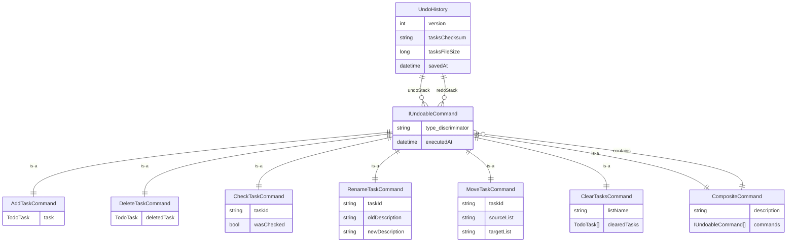

# feat: Add Undo/Redo System for TUI and CLI Modes

## Overview

Implement a complete undo/redo system for cli-tasker that supports all destructive actions, persists history across sessions, and works seamlessly in both TUI and standard CLI modes.

## Problem Statement / Motivation

Currently, cli-tasker has no way to reverse accidental actions. Users who mistakenly delete a task, check the wrong item, or rename something incorrectly have limited recourse:
- Deleted tasks go to trash (can be restored manually)
- Check/uncheck/rename/move have no reversal mechanism

A proper undo/redo system provides:
- **Safety**: Users can experiment without fear of permanent mistakes
- **Efficiency**: Quick reversal instead of manual re-creation
- **Professional UX**: Expected feature in any task management tool

## Proposed Solution

Implement the **Command Pattern** with persistent history:

1. **IUndoableCommand interface** - Each action becomes a command object that can execute forward and backward
2. **UndoManager singleton** - Manages undo/redo stacks, handles persistence
3. **Command classes** - One per undoable action type (AddCommand, DeleteCommand, etc.)
4. **CompositeCommand** - Groups batch operations into single undoable unit
5. **CLI commands** - `tasker undo`, `tasker redo`, `tasker history`
6. **TUI keybindings** - `u` for undo, `Ctrl+R` for redo

## Technical Approach

### Architecture

```
┌─────────────────────────────────────────────────────────────┐
│                        User Actions                          │
│   CLI: tasker delete abc    │   TUI: press 'x' on task      │
└──────────────┬──────────────┴──────────────┬────────────────┘
               │                              │
               ▼                              ▼
┌─────────────────────────────────────────────────────────────┐
│                    Command Creation                          │
│   DeleteTaskCommand { DeletedTask = task, ... }             │
└──────────────────────────────┬──────────────────────────────┘
                               │
                               ▼
┌─────────────────────────────────────────────────────────────┐
│                     UndoManager                              │
│  ┌─────────────┐    ┌─────────────┐    ┌─────────────────┐  │
│  │ Execute cmd │ -> │ Push to     │ -> │ Clear redo      │  │
│  │ via cmd     │    │ undo stack  │    │ stack           │  │
│  └─────────────┘    └─────────────┘    └─────────────────┘  │
│                                                              │
│  Undo(): Pop undo -> Execute Undo() -> Push to redo         │
│  Redo(): Pop redo -> Execute Execute() -> Push to undo      │
└──────────────────────────────┬──────────────────────────────┘
                               │
                               ▼
┌─────────────────────────────────────────────────────────────┐
│              Persistence (undo-history.json)                 │
│  { version, checksum, undoStack[], redoStack[] }            │
└─────────────────────────────────────────────────────────────┘
```

### File Structure

```
Undo/
├── IUndoableCommand.cs      # Interface + JSON polymorphism attributes
├── UndoManager.cs           # Singleton manager
├── UndoHistory.cs           # Persistence record
├── UndoConfig.cs            # Constants (limits, paths)
└── Commands/
    ├── AddTaskCommand.cs
    ├── DeleteTaskCommand.cs
    ├── CheckTaskCommand.cs
    ├── UncheckTaskCommand.cs
    ├── RenameTaskCommand.cs
    ├── MoveTaskCommand.cs
    ├── ClearTasksCommand.cs
    └── CompositeCommand.cs
```

### Implementation Phases

#### Phase 1: Core Infrastructure

**Files to create:**

```csharp
// Undo/IUndoableCommand.cs
namespace cli_tasker.Undo;

using System.Text.Json.Serialization;

[JsonPolymorphic(TypeDiscriminatorPropertyName = "$type")]
[JsonDerivedType(typeof(Commands.AddTaskCommand), "add")]
[JsonDerivedType(typeof(Commands.DeleteTaskCommand), "delete")]
[JsonDerivedType(typeof(Commands.CheckTaskCommand), "check")]
[JsonDerivedType(typeof(Commands.UncheckTaskCommand), "uncheck")]
[JsonDerivedType(typeof(Commands.RenameTaskCommand), "rename")]
[JsonDerivedType(typeof(Commands.MoveTaskCommand), "move")]
[JsonDerivedType(typeof(Commands.ClearTasksCommand), "clear")]
[JsonDerivedType(typeof(Commands.CompositeCommand), "batch")]
public interface IUndoableCommand
{
    string Description { get; }
    DateTime ExecutedAt { get; }
    void Execute();
    void Undo();
}
```

```csharp
// Undo/UndoConfig.cs
namespace cli_tasker.Undo;

public static class UndoConfig
{
    public const int MaxUndoStackSize = 50;
    public const int MaxRedoStackSize = 50;
    public const int HistoryRetentionDays = 30;
    public const bool PersistAcrossSessions = true;

    public static readonly string HistoryPath = Path.Combine(
        Environment.GetFolderPath(Environment.SpecialFolder.ApplicationData),
        "cli-tasker",
        "undo-history.json");
}
```

```csharp
// Undo/UndoHistory.cs
namespace cli_tasker.Undo;

public record UndoHistory
{
    public int Version { get; init; } = 1;
    public string TasksChecksum { get; init; } = "";
    public long TasksFileSize { get; init; }
    public List<IUndoableCommand> UndoStack { get; init; } = [];
    public List<IUndoableCommand> RedoStack { get; init; } = [];
    public DateTime SavedAt { get; init; } = DateTime.Now;
}
```

```csharp
// Undo/UndoManager.cs
namespace cli_tasker.Undo;

public sealed class UndoManager
{
    private static readonly Lazy<UndoManager> _instance = new(() => new UndoManager());
    public static UndoManager Instance => _instance.Value;

    private List<IUndoableCommand> _undoStack = [];
    private List<IUndoableCommand> _redoStack = [];
    private CompositeCommand? _currentBatch;

    public bool CanUndo => _undoStack.Count > 0;
    public bool CanRedo => _redoStack.Count > 0;

    public void RecordCommand(IUndoableCommand command) { ... }
    public void BeginBatch(string description) { ... }
    public void EndBatch() { ... }
    public string? Undo() { ... }
    public string? Redo() { ... }
    public void ClearHistory() { ... }

    private void LoadHistory() { ... }
    private void Save() { ... }
    private bool ValidateChecksum(UndoHistory history) { ... }
}
```

**Success criteria:**
- UndoManager loads/saves history correctly
- Checksum validation works
- Size limits enforced

#### Phase 2: Command Implementations

**State Capture Matrix:**

| Command | Captured State |
|---------|----------------|
| `AddTaskCommand` | Full `TodoTask` record |
| `DeleteTaskCommand` | Full `TodoTask` record |
| `CheckTaskCommand` | `TaskId`, `WasChecked` (previous state) |
| `UncheckTaskCommand` | `TaskId`, `WasChecked` (previous state) |
| `RenameTaskCommand` | `TaskId`, `OldDescription`, `NewDescription` |
| `MoveTaskCommand` | `TaskId`, `SourceList`, `TargetList` |
| `ClearTasksCommand` | `ListName`, `ClearedTasks[]` (all cleared) |
| `CompositeCommand` | `Commands[]` (sub-commands in order) |

**Example command:**

```csharp
// Undo/Commands/DeleteTaskCommand.cs
namespace cli_tasker.Undo.Commands;

public record DeleteTaskCommand : IUndoableCommand
{
    public required TodoTask DeletedTask { get; init; }
    public DateTime ExecutedAt { get; init; } = DateTime.Now;

    public string Description => $"Delete: {DeletedTask.Description[..Math.Min(30, DeletedTask.Description.Length)]}";

    public void Execute()
    {
        var taskList = new TodoTaskList();
        taskList.DeleteTask(DeletedTask.Id, save: true, moveToTrash: true);
    }

    public void Undo()
    {
        // Restore from captured state (not trash - trash may be cleared)
        var taskList = new TodoTaskList();
        taskList.AddTodoTask(DeletedTask);
    }
}
```

**Success criteria:**
- Each command type correctly captures state
- Undo reverses the action precisely
- Commands serialize/deserialize correctly

#### Phase 3: Integration with Existing Operations

**Modify existing command handlers to record undo commands:**

```csharp
// In TodoTaskList.cs - wrap operations
public void DeleteTask(string taskId, bool save = true, bool moveToTrash = true, bool recordUndo = true)
{
    var task = GetTodoTaskById(taskId);
    if (task == null) { /* error */ return; }

    if (recordUndo)
    {
        var cmd = new DeleteTaskCommand { DeletedTask = task };
        UndoManager.Instance.RecordCommand(cmd);
    }

    // ... existing logic ...
}
```

**Batch operation integration:**

```csharp
// In TodoTaskList.cs
public void DeleteTasks(string[] taskIds)
{
    UndoManager.Instance.BeginBatch($"Delete {taskIds.Length} tasks");

    foreach (var taskId in taskIds)
    {
        DeleteTask(taskId, save: false, recordUndo: true);
    }

    UndoManager.Instance.EndBatch();
    Save();
}
```

**Success criteria:**
- All destructive operations record undo commands
- Batch operations create composite commands
- No double-recording in nested calls

#### Phase 4: CLI Commands

**New commands:**

```csharp
// AppCommands/UndoCommand.cs
public static class UndoCommand
{
    public static (Command undo, Command redo, Command history) CreateUndoCommands()
    {
        var undoCmd = new Command("undo", "Undo the last action");
        undoCmd.SetAction(CommandHelper.WithErrorHandling(_ =>
        {
            var desc = UndoManager.Instance.Undo();
            if (desc != null)
                Output.Success($"Undone: {desc}");
            else
                Output.Info("Nothing to undo");
        }));

        var redoCmd = new Command("redo", "Redo the last undone action");
        redoCmd.SetAction(CommandHelper.WithErrorHandling(_ =>
        {
            var desc = UndoManager.Instance.Redo();
            if (desc != null)
                Output.Success($"Redone: {desc}");
            else
                Output.Info("Nothing to redo");
        }));

        var historyCmd = new Command("history", "Show undo/redo history");
        // ... implementation ...

        return (undoCmd, redoCmd, historyCmd);
    }
}
```

**Register in Program.cs:**

```csharp
var (undoCmd, redoCmd, historyCmd) = UndoCommand.CreateUndoCommands();
rootCommand.AddCommand(undoCmd);
rootCommand.AddCommand(redoCmd);
rootCommand.AddCommand(historyCmd);
```

**Success criteria:**
- `tasker undo` reverses last action
- `tasker redo` re-applies last undone action
- `tasker history` shows stack contents

#### Phase 5: TUI Integration

**Add TuiMode for history display (optional):**

```csharp
// Tui/TuiState.cs - add mode
public enum TuiMode
{
    Normal,
    Search,
    MultiSelect,
    InputAdd,
    InputRename,
    // History  // Optional: visual history panel
}
```

**Add keybindings in TuiKeyHandler.cs:**

```csharp
// In HandleNormalMode
case ConsoleKey.U:
    return PerformUndo(state);

case ConsoleKey.R when (key.Modifiers & ConsoleModifiers.Control) != 0:
    return PerformRedo(state);

// Helper methods
private TuiState PerformUndo(TuiState state)
{
    var desc = UndoManager.Instance.Undo();
    return desc != null
        ? state.WithStatusMessage($"Undone: {desc}")
        : state.WithStatusMessage("Nothing to undo");
}

private TuiState PerformRedo(TuiState state)
{
    var desc = UndoManager.Instance.Redo();
    return desc != null
        ? state.WithStatusMessage($"Redone: {desc}")
        : state.WithStatusMessage("Nothing to redo");
}
```

**Update TUI hints in TuiRenderer.cs:**

```csharp
TuiMode.Normal => "[dim]↑↓[/]:nav [dim]space[/]:toggle [dim]x[/]:del [dim]u[/]:undo [dim]^R[/]:redo [dim]q[/]:quit",
```

**Success criteria:**
- `u` key triggers undo in TUI
- `Ctrl+R` triggers redo in TUI
- Status messages show undo/redo feedback

#### Phase 6: Edge Cases & Error Handling

**New exceptions:**

```csharp
// Exceptions/UndoExceptions.cs
public class UndoException : TaskerException
{
    public UndoException(string message) : base(message) { }
}

public class CannotUndoException : UndoException
{
    public CannotUndoException(string reason)
        : base($"Cannot undo: {reason}") { }
}
```

**Handle edge cases:**

1. **Task deleted from trash before undo**: Restore from command's captured state (not trash)
2. **List no longer exists**: Create list automatically during undo
3. **Corrupted history**: Clear history, show warning
4. **Cross-session checksum mismatch**: Clear history, inform user

```csharp
// In UndoManager.LoadHistory()
if (!ValidateChecksum(history))
{
    Output.Warning("Task file changed externally. Undo history cleared.");
    _undoStack = [];
    _redoStack = [];
    return;
}
```

**Success criteria:**
- Graceful degradation on errors
- Clear user messaging
- No data loss scenarios

## Acceptance Criteria

### Functional Requirements

- [x] `tasker undo` reverses the last undoable action
- [x] `tasker redo` re-applies the last undone action
- [x] `tasker history` displays undo/redo stacks
- [x] TUI `u` key triggers undo
- [x] TUI `Ctrl+R` triggers redo
- [x] All destructive actions are undoable: add, delete, check, uncheck, rename, move, clear
- [x] Batch operations (multiple IDs) create single undoable unit
- [x] Redo stack clears when new action performed
- [x] History persists across CLI/TUI sessions
- [x] History validated via checksum on load

### Non-Functional Requirements

- [ ] History file < 100KB for typical usage
- [ ] Undo stack limited to 50 commands
- [ ] Undo/redo operations complete in < 100ms
- [ ] Cross-session history loads in < 50ms

### Quality Gates

- [ ] All command types have unit tests
- [ ] Integration tests for CLI commands
- [ ] TUI keybinding tests
- [ ] Edge case tests (empty stack, corrupted file, checksum mismatch)

## Dependencies & Prerequisites

- None - builds on existing architecture

## Risk Analysis & Mitigation

| Risk | Probability | Impact | Mitigation |
|------|-------------|--------|------------|
| Checksum validation too strict | Medium | Medium | Use file size + hash; offer "force undo" flag |
| History file corruption | Low | Medium | Validate JSON on load; clear on error |
| Performance with large history | Low | Low | Enforce 50-command limit; lazy loading |
| Conflicting TUI keybindings | Low | Low | `u` is free; `Ctrl+R` avoids `r` (rename) |

## Future Considerations

- **Visual history panel**: Show scrollable undo history in TUI
- **Selective undo**: Undo specific action from history (not just most recent)
- **Undo groups**: Named checkpoints user can return to
- **`trash clear` undo**: Deep archive for permanent deletions (complex)

## References & Research

### Internal References

- Trash system pattern: `TodoTask/TodoTaskList.cs:112-129`
- Immutable state pattern: `Tui/TuiState.cs`
- Configuration pattern: `Config/AppConfig.cs`
- Command registration: `Program.cs`

### External References

- [Command Pattern in C# - DEV Community](https://dev.to/alikolahdoozan/command-pattern-with-undo-and-redo-in-cnet-c0n)
- [System.Text.Json Polymorphism - Microsoft Learn](https://learn.microsoft.com/en-us/dotnet/standard/serialization/system-text-json/polymorphism)
- [Undo-Fu-Session persistence patterns](https://codeberg.org/ideasman42/emacs-undo-fu-session)

### Related Work

- TUI mode implementation: PR #1 (merged)
- TUI plan: `docs/plans/2026-01-30-feat-interactive-tui-mode-plan.md`

## ERD: History File Schema



## Example JSON History File

```json
{
  "Version": 1,
  "TasksChecksum": "A1B2C3D4E5F6",
  "TasksFileSize": 2048,
  "UndoStack": [
    {
      "$type": "delete",
      "DeletedTask": {
        "Id": "abc",
        "Description": "Buy groceries",
        "IsChecked": false,
        "CreatedAt": "2026-01-15T10:30:00",
        "ListName": "tasks"
      },
      "ExecutedAt": "2026-02-01T14:22:00"
    },
    {
      "$type": "batch",
      "Description": "Check 3 tasks",
      "Commands": [
        { "$type": "check", "TaskId": "def", "WasChecked": false, "ExecutedAt": "2026-02-01T14:20:00" },
        { "$type": "check", "TaskId": "ghi", "WasChecked": false, "ExecutedAt": "2026-02-01T14:20:00" },
        { "$type": "check", "TaskId": "jkl", "WasChecked": false, "ExecutedAt": "2026-02-01T14:20:00" }
      ],
      "ExecutedAt": "2026-02-01T14:20:00"
    }
  ],
  "RedoStack": [],
  "SavedAt": "2026-02-01T14:22:00"
}
```
