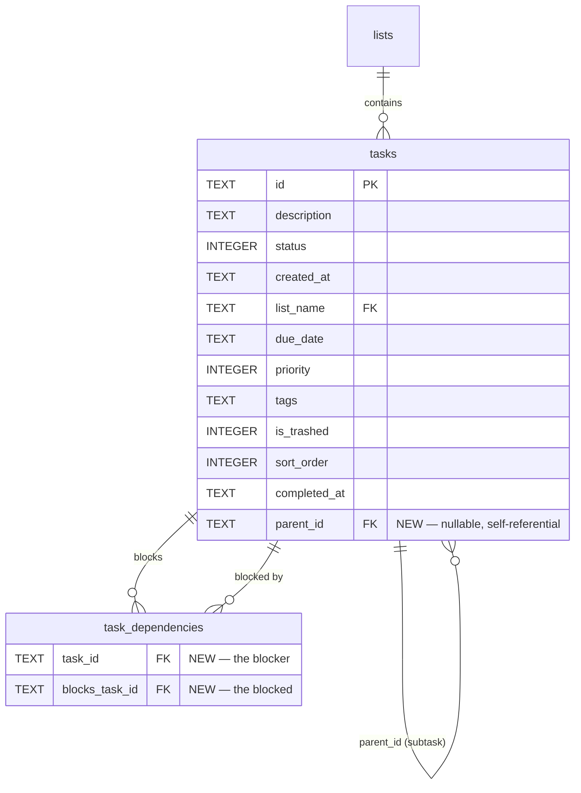

# feat: Task dependencies — subtasks and blocking

## Overview

Add two relationship types between tasks: **subtasks** (hierarchical parent-child) and **blocking** (directional dependency). Both integrate into the existing inline metadata parsing system using `^parentId` and `!blockedId` tokens. Relationships are displayed across all three surfaces (CLI, TUI, Tray) and managed via inline syntax during creation and a `tasker deps` subcommand group for existing tasks.

## Problem Statement

Tasks currently exist as flat, independent items. Real workflows have natural hierarchies (a project broken into subtasks) and dependencies (task A must be done before task B makes sense). Without these, users track relationships mentally or via description text, which breaks down as task counts grow.

## Proposed Solution

Per the [brainstorm](../brainstorms/2026-02-06-task-dependencies-brainstorm.md):

1. **Subtasks** — `^parentId` inline token. Single parent (tree, not DAG). Unlimited nesting. Checking a parent cascade-checks all descendants. Trashing a parent cascade-trashes all descendants. Moving a parent cascade-moves all descendants. Deleting a parent cascade-deletes all descendants (FK).
2. **Blocking** — `!blockedId` inline token. Many-to-many via join table. Visual-only (no enforcement). Cross-list allowed. Circular blocking prevented on insert (warning, task still created).

## Technical Approach

### Architecture



### Implementation Phases

#### Phase 1: Schema + Data Model + Parser

Foundation layer. No UI changes yet — just the data plumbing.

**1.1 Schema migration** (`src/TaskerCore/Data/TaskerDb.cs`)

- [ ] Add `MigrateAddDependencies()` method following the `MigrateAddCompletedAt()` pattern at line 178
- [ ] Check `PRAGMA table_info(tasks)` for `parent_id` column existence
- [ ] If missing: `ALTER TABLE tasks ADD COLUMN parent_id TEXT REFERENCES tasks(id) ON DELETE CASCADE`
- [ ] `CREATE INDEX IF NOT EXISTS idx_tasks_parent_id ON tasks(parent_id)`
- [ ] `CREATE TABLE IF NOT EXISTS task_dependencies (task_id TEXT NOT NULL REFERENCES tasks(id) ON DELETE CASCADE, blocks_task_id TEXT NOT NULL REFERENCES tasks(id) ON DELETE CASCADE, PRIMARY KEY (task_id, blocks_task_id), CHECK (task_id != blocks_task_id))`
- [ ] Clear undo history (old serialized commands lack `ParentId` field)
- [ ] Call `MigrateAddDependencies()` from `EnsureCreated()` at line 109

**1.2 Model changes** (`src/TaskerCore/Models/TodoTask.cs`)

- [ ] Add `string? ParentId = null` parameter to `TodoTask` record (after `CompletedAt`)
- [ ] Update `CreateTodoTask()` factory to parse `ParentId` from `ParsedTask` and pass it through
- [ ] Add `SetParent(string parentId)` → `this with { ParentId = parentId }`
- [ ] Add `ClearParent()` → `this with { ParentId = null }`
- [ ] Add computed `bool HasParent => ParentId != null`
- [ ] Update `Rename()` to re-parse `ParentId` from new description (like it does for Priority/Tags)

**1.3 ParsedTask changes** (`src/TaskerCore/Parsing/TaskDescriptionParser.cs`)

- [ ] Extend `ParsedTask` record with `string? ParentId = null` and `string[]? BlocksIds = null`
- [ ] Add `[GeneratedRegex(@"(?:^|\s)\^(\w{3})(?:\s|$)")]` → `ParentRefRegex()`
- [ ] Add `[GeneratedRegex(@"(?:^|\s)!(\w{3})(?:\s|$)")]` → `BlocksRefRegex()`
- [ ] Update `Parse()`: add both regexes to the stripping logic at line 30-33 for `isMetadataOnly` check
- [ ] Extract `ParentId` from `ParentRefRegex().Match(lastLine)` (take first match only — single parent)
- [ ] Extract `BlocksIds` from `BlocksRefRegex().Matches(lastLine)` (collect all matches — many-to-many)
- [ ] Update `GetDisplayDescription()` at line 88-101: add both regexes to stripping logic
- [ ] Update `SyncMetadataToDescription()` at line 115: accept `string? parentId` and `string[]? blocksIds` params, include `^parentId` and `!blockId` tokens in the rebuilt metadata line

**1.4 Data layer — ReadTask + InsertTask + UpdateTask** (`src/TaskerCore/Data/TodoTaskList.cs`)

- [ ] Update `TaskSelectColumns` (line 68) to include `parent_id` → ordinal 9
- [ ] Update `ReadTask()` (line 33): read `parent_id` at ordinal 9, pass to `TodoTask` constructor
- [ ] Update `InsertTask()` (line 173): add `parent_id` to INSERT statement and bind `@parent` param
- [ ] Update `UpdateTask()` (line 201): add `parent_id` to UPDATE statement and bind `@parent` param

**1.5 Data layer — Dependency operations** (`src/TaskerCore/Data/TodoTaskList.cs`)

New methods on `TodoTaskList`:

- [ ] `SetParent(string taskId, string parentId, bool recordUndo = true)` — validates same-list constraint, no circular reference, sets `parent_id`. Returns `TaskResult`.
- [ ] `UnsetParent(string taskId, bool recordUndo = true)` — clears `parent_id`. Returns `TaskResult`.
- [ ] `AddBlocker(string blockerId, string blockedId, bool recordUndo = true)` — inserts into `task_dependencies`. Validates no self-reference, no circular dependency (walk the graph). Returns `TaskResult`.
- [ ] `RemoveBlocker(string blockerId, string blockedId, bool recordUndo = true)` — deletes from `task_dependencies`. Returns `TaskResult`.
- [ ] `GetSubtasks(string parentId)` — `SELECT ... WHERE parent_id = @id AND is_trashed = 0`
- [ ] `GetAllDescendants(string parentId)` — recursive CTE: `WITH RECURSIVE desc AS (SELECT id FROM tasks WHERE parent_id = @id UNION ALL SELECT t.id FROM tasks t JOIN desc d ON t.parent_id = d.id) SELECT id FROM desc WHERE is_trashed = 0`
- [ ] `GetBlockedBy(string taskId)` — `SELECT ... FROM task_dependencies td JOIN tasks t ON td.task_id = t.id WHERE td.blocks_task_id = @id AND t.is_trashed = 0`
- [ ] `GetBlocks(string taskId)` — `SELECT ... FROM task_dependencies td JOIN tasks t ON td.blocks_task_id = t.id WHERE td.task_id = @id AND t.is_trashed = 0`
- [ ] `HasCircularBlocking(string blockerId, string blockedId)` — walk the blocking graph from `blockedId` to see if it reaches `blockerId`

**1.6 Cascade operations** (`src/TaskerCore/Data/TodoTaskList.cs`)

Update existing methods to handle subtask cascading:

- [ ] Update `DeleteTask()` (line 336): when trashing a parent, also trash all descendants (application-level cascade for soft delete). Use `GetAllDescendants()` + batch `UPDATE tasks SET is_trashed = 1`. Wrap in `BeginBatch()`/`EndBatch()` for undo.
- [ ] Update `RestoreFromTrash()`: when restoring a parent, also restore all descendants that were cascade-trashed.
- [ ] Update `CheckTask()` / `SetTaskStatus()` for Done status: when checking a parent, also check all non-Done descendants. Use `BeginBatch()`/`EndBatch()`. Message: "Checked (abc) and N subtasks". Skip already-Done subtasks in the count.
- [ ] Unchecking a parent does NOT cascade (per decision). Only `tasker undo` reverses a cascade-check.
- [ ] Update `MoveTask()`: when moving a parent, also move all descendants. Use `BeginBatch()`/`EndBatch()`.
- [ ] Prevent moving a subtask independently to a different list. Return error: "Cannot move subtask (id) to a different list. Use `tasker deps unset-parent` first, or move its parent."

**1.7 AddTodoTask with dependency handling** (`src/TaskerCore/Data/TodoTaskList.cs`)

- [ ] Update `AddTodoTask()`: after inserting the task, if `ParsedTask.ParentId` is set:
  - Validate parent exists and is not trashed. If not found → warn, create task without parent.
  - Validate same list. If `-l` flag provided and differs from parent's list → override to parent's list with warning.
  - Set `parent_id` on the inserted row.
- [ ] After inserting, if `ParsedTask.BlocksIds` is set:
  - For each blocked ID: validate exists and is not trashed. If not found → warn, skip that relationship.
  - Check for circular blocking. If circular → warn, skip.
  - Insert into `task_dependencies`.

**1.8 Rename with dependency re-parsing**

- [ ] In `TodoTask.Rename()` (line 45): re-parse `ParentId` from new description, update field.
- [ ] In `TodoTaskList.RenameTask()`: detect if `ParentId` changed → call `SetParent()` or `UnsetParent()`. Detect if `BlocksIds` changed → reconcile with `AddBlocker()`/`RemoveBlocker()`.

**1.9 Parser tests** (`tests/TaskerCore.Tests/Parsing/TaskDescriptionParserTests.cs`)

- [ ] Test `^abc` parsed as `ParentId = "abc"` when last line is metadata-only
- [ ] Test `!h67` parsed as `BlocksIds = ["h67"]` when last line is metadata-only
- [ ] Test multiple blockers: `!h67 !j89` → `BlocksIds = ["h67", "j89"]`
- [ ] Test combined: `^abc !h67 #feature p1` → all fields extracted
- [ ] Test `^abc` NOT parsed when last line has non-metadata text
- [ ] Test `GetDisplayDescription()` hides `^abc` and `!h67` from display
- [ ] Test `SyncMetadataToDescription()` includes `^parentId` and `!blockId` tokens

**1.10 Data layer tests** (`tests/TaskerCore.Tests/Data/`)

- [ ] Test `SetParent()` — sets `parent_id`, verify with `GetTodoTaskById()`
- [ ] Test `UnsetParent()` — clears `parent_id`
- [ ] Test `AddBlocker()` — inserts into `task_dependencies`
- [ ] Test `RemoveBlocker()` — deletes from `task_dependencies`
- [ ] Test `GetSubtasks()` — returns direct children
- [ ] Test `GetAllDescendants()` — returns full tree (recursive)
- [ ] Test `GetBlockedBy()` — returns tasks blocking this one
- [ ] Test `GetBlocks()` — returns tasks blocked by this one
- [ ] Test `HasCircularBlocking()` — detects A→B→C→A cycle
- [ ] Test same-list constraint for `SetParent()`
- [ ] Test cross-list blocking allowed for `AddBlocker()`
- [ ] Test cascade trash — trashing parent trashes all descendants
- [ ] Test cascade restore — restoring parent restores all descendants
- [ ] Test cascade check — checking parent checks all non-Done descendants
- [ ] Test cascade move — moving parent moves all descendants
- [ ] Test prevent moving subtask to different list
- [ ] Test `AddTodoTask` with `^nonexistent` → task created, no parent, warning
- [ ] Test `AddTodoTask` with `!nonexistent` → task created, no blocking row, warning
- [ ] Test circular blocking prevention → task created, blocking skipped, warning
- [ ] Test `RenameTask` with dependency token changes → DB relationships updated
- [ ] Test FK ON DELETE CASCADE — hard-deleting parent removes subtask rows
- [ ] Test FK ON DELETE CASCADE — hard-deleting a task removes its `task_dependencies` rows
- [ ] Test migration on existing database (no `parent_id` column → adds it)

---

#### Phase 2: Undo System

**2.1 New undo commands** (`src/TaskerCore/Undo/Commands/`)

- [ ] `SetParentCommand.cs` — captures `TaskId`, `OldParentId`, `NewParentId`. Execute calls `SetParent()`/`UnsetParent()`. Undo reverses.
- [ ] `AddBlockerCommand.cs` — captures `BlockerId`, `BlockedId`. Execute calls `AddBlocker()`. Undo calls `RemoveBlocker()`.
- [ ] `RemoveBlockerCommand.cs` — captures `BlockerId`, `BlockedId`. Execute calls `RemoveBlocker()`. Undo calls `AddBlocker()`.

- [ ] Register all in `IUndoableCommand.cs` (line 6-18) with `[JsonDerivedType]`:
  - `[JsonDerivedType(typeof(SetParentCommand), "set-parent")]`
  - `[JsonDerivedType(typeof(AddBlockerCommand), "add-blocker")]`
  - `[JsonDerivedType(typeof(RemoveBlockerCommand), "remove-blocker")]`

**2.2 Update existing undo commands**

- [ ] `DeleteTaskCommand.cs` — when capturing a parent task for undo, also capture descendant tasks and their blocking relationships. On undo: restore parent first, then descendants, then blocking relationships.
- [ ] `MoveTaskCommand.cs` — when moving a parent, capture all descendant task IDs and their original list. On undo: move all back.
- [ ] Cascade check uses existing `SetStatusCommand` wrapped in `CompositeCommand` via `BeginBatch()`/`EndBatch()` — no changes needed to the command itself.

**2.3 Undo tests**

- [ ] Test undo `SetParent` → restores old parent
- [ ] Test undo `AddBlocker` → removes the relationship
- [ ] Test undo cascade-check → all subtask statuses restored to originals
- [ ] Test undo cascade-trash → parent and all descendants restored
- [ ] Test undo cascade-move → parent and all descendants return to original list

---

#### Phase 3: CLI Commands

**3.1 Deps subcommand group** (`AppCommands/DepsCommand.cs` — new file)

Following the `TrashCommand.cs` pattern:

- [ ] `CreateDepsCommands()` returns a `Command` with subcommands:
  - `set-parent <taskId> <parentId>` — calls `todoTaskList.SetParent()`
  - `unset-parent <taskId>` — calls `todoTaskList.UnsetParent()`
  - `add-blocker <blockerId> <blockedId>` — calls `todoTaskList.AddBlocker()`
  - `remove-blocker <blockerId> <blockedId>` — calls `todoTaskList.RemoveBlocker()`
- [ ] Register in `Program.cs`

**3.2 Update AddCommand** (`AppCommands/AddCommand.cs`)

- [ ] After creating the task, display warnings for invalid `^ref` or `!ref` (nonexistent, circular, cross-list parent)
- [ ] If parent specified via `^parentId`, override the list to parent's list (ignore `-l` flag if it conflicts, with warning)

**3.3 Update GetCommand** (`AppCommands/GetCommand.cs`)

- [ ] `OutputHumanReadable()`: add sections for Parent, Subtasks, Blocks, Blocked by
  ```
  Parent:      (abc) build mobile app
  Subtasks:    (de1) research frameworks
               (f23) build prototype
  Blocks:      (h67) deploy to production
  Blocked by:  (g45) write documentation
  ```
- [ ] `OutputJson()`: add `parentId`, `subtasks`, `blocks`, `blockedBy` fields

**3.4 Update ListCommand display** (`AppCommands/ListCommand.cs`)

- [ ] Add relationship indicator lines below each task in list output (dim text, matching brainstorm display design)

**3.5 CLI tests**

- [ ] Test `tasker deps set-parent` / `unset-parent` / `add-blocker` / `remove-blocker` (integration tests using in-memory DB)
- [ ] Test `tasker get` shows relationships in human-readable output
- [ ] Test `tasker get --json` includes relationship fields

---

#### Phase 4: TUI Display + Interaction

**4.1 TUI relationship display** (`Tui/TuiRenderer.cs`)

- [ ] In `RenderTask()` (line 122): after rendering tags and due date, render relationship lines:
  - "Subtask of (parentId) truncated-title..." — dim gray
  - "Subtasks: - (id) truncated-title..." (one line per subtask) — dim gray
  - "Blocked by: - (id) truncated-title..." (one line per blocker) — dim yellow
  - "Blocks: - (id) truncated-title..." — dim yellow
  - Single relationship: no list prefix. Multiple: `- ` prefix per item.
- [ ] Update `CountTaskLines()` (line 186): account for relationship lines in viewport budget. Each relationship is one visual line.
- [ ] Relationship data must be available on `TodoTask` or loaded separately. Options:
  - Add `Subtasks`, `BlockedBy`, `Blocks` as transient properties loaded during `TuiApp.LoadTasks()`
  - Or create a `TaskRelationships` dictionary keyed by task ID, passed to the renderer
- [ ] Truncate referenced task titles to fit `Console.WindowWidth - indent - prefix`

**4.2 TUI `s` key — create subtask** (`Tui/TuiKeyHandler.cs`)

- [ ] On `s` key press: enter add mode with `^parentId` pre-filled in the input
- [ ] The new task inherits the parent's list

**4.3 TUI cascade feedback**

- [ ] When checking a parent in TUI, show status bar message: "Checked (abc) and N subtasks"
- [ ] When trashing a parent in TUI, show: "Trashed (abc) and N subtasks"

**4.4 TUI tests**

- [ ] Test viewport budget accounts for relationship lines
- [ ] Test `CountTaskLines()` returns correct height for tasks with relationships

---

#### Phase 5: Tray Display

**5.1 Tray ViewModel** (`src/TaskerTray/ViewModels/TodoTaskViewModel.cs`)

- [ ] Add `ParentDisplay` property — "Subtask of (id) title..." (dim gray)
- [ ] Add `SubtasksDisplay` list — "(id) title..." entries
- [ ] Add `BlockedByDisplay` list — "(id) title..." entries (dim orange)
- [ ] Add `BlocksDisplay` list — "(id) title..." entries (dim orange)
- [ ] Add `HasRelationships` computed property

**5.2 Tray task item rendering** (`src/TaskerTray/Views/TaskListPopup.axaml.cs`)

- [ ] In `CreateTaskItem()` (line 1128): after description preview and before due date, add relationship indicator TextBlocks:
  - Single relationship: plain dim text
  - Multiple: stacked `- (id) title...` lines
  - Colors: gray for subtask references, orange for blocking references
  - Font size: 10pt (matching due date indicator)
- [ ] Truncate referenced task titles to fit popup width

**5.3 Tray relationship data loading** (`src/TaskerTray/ViewModels/TaskListViewModel.cs`)

- [ ] After loading tasks, populate relationship data on each `TodoTaskViewModel`
- [ ] Use batch queries (one query for all subtask relationships, one for all blocking relationships) rather than per-task queries

---

#### Phase 6: Polish + Edge Cases

- [ ] Verify `SyncMetadataToDescription()` round-trips correctly: create → edit → save preserves `^` and `!` tokens
- [ ] Verify `tasker rename` with new dependency tokens updates DB relationships
- [ ] Verify cascade operations in all three surfaces produce consistent results
- [ ] Verify undo for all cascade operations restores full state
- [ ] Verify tray refresh picks up relationship changes from CLI/TUI
- [ ] Performance check: list display with 50+ tasks, some with 5+ relationships each

---

## Resolved Design Decisions

From the [brainstorm](../brainstorms/2026-02-06-task-dependencies-brainstorm.md) and planning Q&A:

| Decision | Choice | Rationale |
|----------|--------|-----------|
| Inline syntax | `^abc` = subtask of, `!def` = blocks def | Consistent with `#tag`, `p1`, `@date` parsing |
| Nesting depth | Unlimited | Full tree structure via recursive CTE |
| Parent completion | Cascade down | Check parent → auto-check all descendants |
| Uncheck cascade | **No** | Only `tasker undo` reverses cascade-check |
| Blocking enforcement | Visual only | Informational, never prevents actions |
| Cross-list subtasks | Prevented | Same list as parent, enforced on set-parent |
| Cross-list blocking | **Allowed** | Blocking is informational, no list restriction |
| Cascade move | Yes | Moving parent moves all descendants |
| Move subtask independently | **Blocked** | Error message, must unset-parent first |
| Trash cascade | **Application-level** | Trashing parent trashes all descendants. FK CASCADE is safety net for hard delete. |
| Restore cascade | **Yes** | Restoring parent restores all descendants |
| Invalid `^`/`!` refs on creation | **Warn, skip, keep task** | Never lose user text |
| Circular blocking | Prevent, warn, keep task | Check on insert, skip invalid relationship |
| Parent cardinality | Single parent only | Tree, not DAG |
| Blocking cardinality | Many-to-many | Join table |
| `!` direction | `!h67` = "I block h67" | Active/assertive |
| Delete parent | FK ON DELETE CASCADE | Consistent with list cascade |
| `deps show` | **No separate command** | Merged into `tasker get` |
| Display style | Due-date-style indicator lines | Consistent across TUI and Tray |
| Context in display | ID + truncated title | "(abc) build mob..." |
| Subtask sorting | Independent | Sorted by own priority/due date in flat list |
| Undo cascade-check | Single batch via BeginBatch/EndBatch | Existing pattern |

## Acceptance Criteria

### Functional Requirements

**Parser:**
- [ ] `^abc` in metadata-only last line → `ParsedTask.ParentId = "abc"`
- [ ] `!h67` in metadata-only last line → `ParsedTask.BlocksIds = ["h67"]`
- [ ] Multiple `!` tokens → all collected
- [ ] Combined `^abc !h67 #feature p1` → all fields extracted
- [ ] Tokens NOT parsed from non-metadata lines
- [ ] `GetDisplayDescription()` hides `^` and `!` tokens
- [ ] `SyncMetadataToDescription()` includes `^` and `!` tokens

**Schema:**
- [ ] `parent_id` column added to tasks table on migration
- [ ] `task_dependencies` table created on migration
- [ ] FK constraints work (ON DELETE CASCADE)
- [ ] Migration is idempotent (safe to run multiple times)
- [ ] Undo history cleared on migration

**Data operations:**
- [ ] `SetParent()` / `UnsetParent()` work correctly
- [ ] `AddBlocker()` / `RemoveBlocker()` work correctly
- [ ] Same-list constraint enforced for subtasks
- [ ] Cross-list blocking allowed
- [ ] Circular blocking detected and prevented
- [ ] Self-reference prevented (CHECK constraint)
- [ ] Invalid refs during creation → warn, skip, keep task

**Cascade operations:**
- [ ] Checking a parent checks all non-Done descendants
- [ ] Unchecking a parent does NOT cascade
- [ ] Trashing a parent trashes all descendants
- [ ] Restoring a parent restores all descendants
- [ ] Moving a parent moves all descendants
- [ ] Moving a subtask independently is blocked with error message
- [ ] All cascade operations are undoable

**CLI:**
- [ ] `tasker deps set-parent <taskId> <parentId>` works
- [ ] `tasker deps unset-parent <taskId>` works
- [ ] `tasker deps add-blocker <blockerId> <blockedId>` works
- [ ] `tasker deps remove-blocker <blockerId> <blockedId>` works
- [ ] `tasker add "text ^abc"` creates subtask of abc
- [ ] `tasker add "text !h67"` creates task that blocks h67
- [ ] `tasker get abc` shows all relationships
- [ ] `tasker get abc --json` includes all relationship fields

**TUI:**
- [ ] Relationship indicator lines displayed below tasks
- [ ] `s` key creates subtask of highlighted task
- [ ] Viewport budget accounts for relationship lines
- [ ] Cascade feedback shown in status bar

**Tray:**
- [ ] Relationship indicator lines displayed in task items
- [ ] Colors: gray for subtask refs, orange for blocking refs
- [ ] Data refreshes when relationships change

### Quality Gates

- [ ] All existing 136 tests still pass
- [ ] New parser tests (7+)
- [ ] New data layer tests (20+)
- [ ] New undo tests (5+)
- [ ] Migration tested on existing database

## Dependencies & Prerequisites

- Existing `TaskDescriptionParser` inline parsing infrastructure
- Existing `BeginBatch()`/`EndBatch()` for cascade undo
- Existing `IUndoableCommand` + `[JsonDerivedType]` registration
- Existing `MigrateAddCompletedAt()` pattern for schema migration
- SQLite recursive CTE support (available in all modern SQLite versions)

## Risk Analysis & Mitigation

| Risk | Likelihood | Impact | Mitigation |
|------|-----------|--------|------------|
| Soft delete (trash) doesn't trigger FK CASCADE | Certain | High | Application-level cascade for trash operations |
| Undo for cascade-trash misses descendants | Medium | High | Capture all descendants in batch undo command |
| Recursive CTE performance on deep trees | Low | Medium | Task trees rarely exceed 3-4 levels deep |
| Parser false positives (`!inc` in "incredible!inc") | Low | Low | Only parsed from metadata-only last lines |
| Undo history deserialization after migration | Certain | Low | Clear undo history during migration |

## References & Research

### Internal References

- Brainstorm: `docs/brainstorms/2026-02-06-task-dependencies-brainstorm.md`
- Parser: `src/TaskerCore/Parsing/TaskDescriptionParser.cs` (all lines)
- Schema: `src/TaskerCore/Data/TaskerDb.cs:62-113`
- Migration pattern: `src/TaskerCore/Data/TaskerDb.cs:178-190` (MigrateAddCompletedAt)
- ReadTask mapper: `src/TaskerCore/Data/TodoTaskList.cs:33-65`
- InsertTask: `src/TaskerCore/Data/TodoTaskList.cs:173-199`
- UpdateTask: `src/TaskerCore/Data/TodoTaskList.cs:201-220`
- DeleteTask (trash): `src/TaskerCore/Data/TodoTaskList.cs:336-370`
- Undo interface: `src/TaskerCore/Undo/IUndoableCommand.cs:1-25`
- DeleteTaskCommand undo: `src/TaskerCore/Undo/Commands/DeleteTaskCommand.cs:1-32`
- TodoTask model: `src/TaskerCore/Models/TodoTask.cs:1-72`
- GetCommand display: `AppCommands/GetCommand.cs:83-106`
- TUI renderer: `Tui/TuiRenderer.cs:122-184` (RenderTask)
- Tray task item: `src/TaskerTray/Views/TaskListPopup.axaml.cs:1128-1396` (CreateTaskItem)

### Institutional Learnings

- `docs/solutions/feature-implementations/task-metadata-inline-system.md` — Parser patterns, shell safety, bidirectional sync
- `docs/solutions/database-issues/json-to-sqlite-storage-migration.md` — Migration checklist, undo history clearing
- `docs/solutions/ui-bugs/tui-buffered-rendering-and-line-wrapping.md` — Viewport budgeting, WrapLine consistency
- `docs/solutions/feature-implementations/done-tasks-sort-by-completion-time.md` — Complete checklist for adding columns to TodoTask
- `docs/solutions/testing/test-isolation-prevention-strategies.md` — Test patterns for cascade operations
- `docs/solutions/logic-errors/inconsistent-task-sort-order-across-consumers.md` — Always use GetSortedTasks() for display
