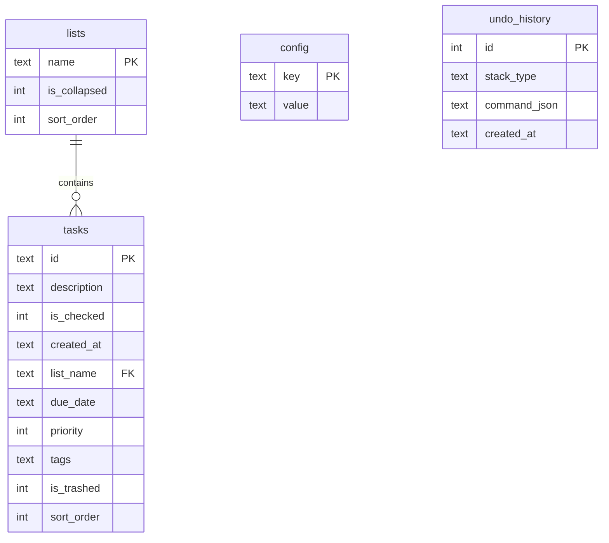

# refactor: Migrate storage from JSON files to SQLite

## Overview

Replace all JSON file-based persistence (5 files: tasks, trash, config, undo history, backups) with a single SQLite database (`tasker.db`). This unifies storage, enables future mobile app integration, and simplifies test isolation with in-memory SQLite.

## Problem Statement

The current storage uses multiple JSON files that are fully loaded into memory, serialized/deserialized on every operation, and lack query capabilities. Sorting and filtering happen via in-memory LINQ. Tests require temp directory creation and cleanup. A planned mobile companion app needs a storage format that works cross-platform.

## Proposed Solution

Use `Microsoft.Data.Sqlite` (raw ADO.NET) with direct SQL queries. No ORM, no entity layer — the existing immutable records (`TodoTask`, `TaskList`) stay as-is, with helper methods to map between SQL results and records. All data lives in `~/Library/Application Support/cli-tasker/tasker.db` with WAL journal mode for concurrent CLI + tray access.

### Library Choice: Microsoft.Data.Sqlite

Reviewers pushed back on the entity layer that sqlite-net would require. Since the existing models are immutable records (no parameterless constructors), raw SQL with `Microsoft.Data.Sqlite` is cleaner:
- No entity classes needed — map SQL results directly to existing records
- `BackupDatabase()` method built-in for hot backups
- Part of the .NET ecosystem, well-maintained
- Full control over queries and transactions

## Schema

```sql
CREATE TABLE lists (
    name TEXT PRIMARY KEY,
    is_collapsed INTEGER DEFAULT 0,
    sort_order INTEGER DEFAULT 0
);

CREATE TABLE tasks (
    id TEXT PRIMARY KEY,
    description TEXT NOT NULL,
    is_checked INTEGER DEFAULT 0,
    created_at TEXT NOT NULL,
    list_name TEXT NOT NULL REFERENCES lists(name) ON UPDATE CASCADE ON DELETE CASCADE,
    due_date TEXT,
    priority INTEGER,
    tags TEXT,          -- JSON array string
    is_trashed INTEGER DEFAULT 0,
    sort_order INTEGER DEFAULT 0
);

CREATE TABLE config (
    key TEXT PRIMARY KEY,
    value TEXT NOT NULL
);

CREATE TABLE undo_history (
    id INTEGER PRIMARY KEY AUTOINCREMENT,
    stack_type TEXT NOT NULL CHECK(stack_type IN ('undo', 'redo')),
    command_json TEXT NOT NULL,
    created_at TEXT NOT NULL
);

-- Indexes for common queries
CREATE INDEX idx_tasks_list_name ON tasks(list_name);
CREATE INDEX idx_tasks_is_trashed ON tasks(is_trashed);
CREATE INDEX idx_tasks_sort ON tasks(is_checked, priority, due_date, created_at);
CREATE INDEX idx_undo_stack_type ON undo_history(stack_type);
```



## Implementation Phases

### Phase 1: Database Foundation + Core Migration

Create `TaskerDb` and rewrite all data access to use SQLite.

**Tasks:**
- [ ] Add `Microsoft.Data.Sqlite` NuGet package to `TaskerCore`
- [ ] Create `src/TaskerCore/Data/TaskerDb.cs` — database connection manager
  - Constructor takes connection string (file path or `:memory:`)
  - `EnsureCreated()` runs `CREATE TABLE IF NOT EXISTS` for all tables + indexes
  - WAL mode + foreign keys enabled on connection open
  - Single `SqliteConnection` per instance
  - `TaskerDb.CreateInMemory()` static factory for tests
- [ ] Update `StoragePaths` to add `DatabasePath` property
- [ ] Update `TaskerServices` to add `Db` property (inject `TaskerDb`)
  - Add `TaskerServices.CreateInMemory()` factory for test isolation
- [ ] Rewrite `TodoTaskList` to use SQL queries instead of JSON Load/Save
  - Each operation = direct SQL (no Load/Save cycle)
  - Remove `SaveLock` — SQLite handles concurrency via transactions
  - Remove `DeserializeWithMigration` (move to `JsonMigrator`)
  - All multi-step operations wrapped in transactions
- [ ] Update `ListManager` to use SQL queries through `TaskerDb`
- [ ] Rewrite `AppConfig` to use `config` table
- [ ] Rewrite `UndoManager` to use `undo_history` table
  - Keep existing `IUndoableCommand` JSON serialization for `command_json` column
  - Remove checksum validation — SQLite transactions guarantee consistency
- [ ] Rewrite `BackupManager` for SQLite
  - `CreateBackup()` → `BackupDatabase()` to backup path
  - `RestoreBackup()` → Reverse backup (copy backup to main db)
  - Keep file-based backups (`.db` copies) in `backups/` directory

**Files:**
- `src/TaskerCore/TaskerCore.csproj` (add NuGet)
- `src/TaskerCore/Data/TaskerDb.cs` (new)
- `src/TaskerCore/StoragePaths.cs` (modify)
- `src/TaskerCore/TaskerServices.cs` (modify)
- `src/TaskerCore/Data/TodoTaskList.cs` (major rewrite)
- `src/TaskerCore/Data/ListManager.cs` (update)
- `src/TaskerCore/Config/AppConfig.cs` (rewrite)
- `src/TaskerCore/Undo/UndoManager.cs` (rewrite)
- `src/TaskerCore/Backup/BackupManager.cs` (rewrite)

### Phase 2: Auto-Migration from JSON

**Tasks:**
- [ ] Create `src/TaskerCore/Data/JsonMigrator.cs`
  - Detects if JSON files exist and `.db` does not
  - Reads existing JSON files using current deserialization (with migration support)
  - Inserts all data into SQLite tables within a transaction
  - Renames old files to `.bak`
  - Runs automatically on `TaskerDb.EnsureCreated()` if migration needed
- [ ] Preserve `DeserializeWithMigration` logic in the migrator for old-format support

**Files:**
- `src/TaskerCore/Data/JsonMigrator.cs` (new)

### Phase 3: Tests + Cleanup

**Tasks:**
- [ ] Update test base to use in-memory SQLite via `TaskerServices.CreateInMemory()`
  - Remove temp directory creation/cleanup
  - Remove `[Collection("IsolatedTests")]` — in-memory dbs are naturally isolated
  - Each test gets its own `SqliteConnection` instance
- [ ] Update all existing tests
- [ ] Add new tests for `JsonMigrator`
- [ ] Add tests for `TaskerDb.EnsureCreated()` schema creation
- [ ] Update CLAUDE.md architecture documentation
- [ ] Update MEMORY.md test patterns
- [ ] Remove unused JSON serialization code

**Files:**
- `tests/TaskerCore.Tests/**/*Tests.cs` (all test files)
- `CLAUDE.md` (update architecture section)

## Acceptance Criteria

### Functional Requirements
- [ ] All existing CLI commands work identically after migration
- [ ] All existing tray app functionality works after migration
- [ ] Existing JSON data is auto-migrated on first run
- [ ] Old JSON files renamed to `.bak` after migration
- [ ] Undo/redo works across sessions
- [ ] Backup/restore works with SQLite files
- [ ] `tasker system status` shows correct stats

### Non-Functional Requirements
- [ ] WAL mode enabled for concurrent access
- [ ] Foreign keys enabled
- [ ] Indexes on frequently queried columns
- [ ] In-memory SQLite used for all tests
- [ ] All 93+ existing tests pass after migration

### Quality Gates
- [ ] Zero regressions in existing test suite
- [ ] New tests for migration path
- [ ] CLAUDE.md updated with new architecture

## Dependencies

- **NuGet:** `Microsoft.Data.Sqlite` (latest stable)

## Risk Analysis

| Risk | Impact | Mitigation |
|------|--------|------------|
| Data loss during migration | High | Auto-backup JSON to `.bak` before migration; test migration thoroughly |
| Concurrent access issues (CLI + tray) | Medium | WAL mode; single-writer SQLite semantics are well-understood |
| Test isolation breaks | Medium | In-memory SQLite is naturally isolated per connection |
| Breaking change in public API | Low | Keep all public method signatures identical; only internals change |

## References

- Brainstorm: `docs/brainstorms/2026-02-06-sqlite-storage-migration-brainstorm.md`
- Microsoft.Data.Sqlite backup: https://learn.microsoft.com/en-us/dotnet/standard/data/sqlite/backup
- `src/TaskerCore/Data/TodoTaskList.cs` — current JSON persistence
- `src/TaskerCore/TaskerServices.cs` — DI container
- `src/TaskerCore/StoragePaths.cs` — file paths
- `src/TaskerCore/Undo/UndoManager.cs` — undo persistence
- `src/TaskerCore/Backup/BackupManager.cs` — backup system
- `docs/solutions/` — test isolation learnings from 2026-02-05
